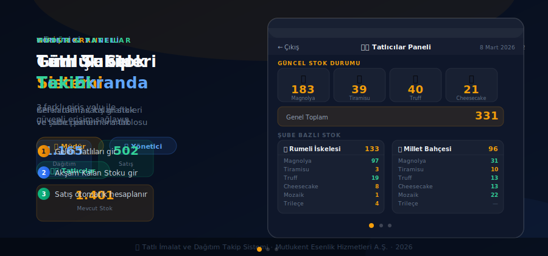

<div align="center">

# 🍮 Tatlı İmalat ve Dağıtım Takip Sistemi

**Mutlukent Esenlik Hizmetleri A.Ş.** için geliştirilmiş, 6 şubeli tatlı üretim ve dağıtım takip platformu.

[](https://tli-takip.vercel.app)
[](https://tli-takip.vercel.app)
[](https://supabase.com)
[](https://tli-takip.vercel.app)
[](/)

</div>

---

## 📖 Hakkında

6 farklı şubede günlük tatlı dağıtımını, stok girişini ve satış takibini merkezi bir platform üzerinden yöneten web uygulaması. Şube müdürleri sabah teslim alınan tatlıları, akşam kalan stoku sisteme girer; satış otomatik hesaplanır ve yönetici anlık raporlara erişir.

```
Tatlıcı üretir → Şubeye teslim → Müdür girer → Satış otomatik → Yönetici raporlar
```

---

## ✨ Özellikler

| Özellik | Açıklama |
|---------|----------|
| 📦 **Gelen Tatlılar** | Her şubeye günlük teslim alınan ürünlerin miktarını kayıt altına al |
| ✅ **Kalan Tatlılar** | Gün sonu stok sayımı — satış `Gelen − Kalan` ile otomatik hesaplanır |
| 🔄 **Şube Arası Transfer** | Fazla stoku başka şubeye gönder, iki şubeye birden anlık yansır |
| 📊 **Aylık Rapor** | Şube bazlı aylık gelen / satılan / kalan istatistikleri |
| 🏢 **Admin Dashboard** | Tüm şubelerin KPI kartları, bar grafiği ve performans tablosu |
| 👨‍🍳 **Tatlıcı Paneli** | Üretim planlaması için PIN korumalı anlık stok görünümü |
| 🏭 **Üretim Paneli** | Şifresiz erişimli şube × tatlı matris tablosu |
| 📱 **PWA Desteği** | Ana ekrana eklenebilir, amber ikonlu — maskable PWA uyumlu |
| 🔒 **Rol Bazlı Erişim** | Yönetici / Müdür / Tatlıcı / Üretim — her rol ayrı korumalı |
| ⚡ **Anlık Güncelleme** | Otomatik yenileme: Tatlıcı 60sn · Üretim 5dak · Admin 30sn |

---

## 👥 Kullanıcı Rolleri

```
┌─────────────────────────────────────────────────────────────────────┐
│                    KULLANICI ROL MATRİSİ                           │
├──────────────┬─────────────┬───────────────┬──────────────────────┤
│     Rol      │   Erişim    │  Kim Kullanır │       Yetkiler        │
├──────────────┼─────────────┼───────────────┼──────────────────────┤
│ 🏢 Yönetici  │ Kullanıcı + │  Merkez Mgmt  │ Tüm raporlar, KPI   │
│              │   Şifre     │               │ analitik, grafikler  │
├──────────────┼─────────────┼───────────────┼──────────────────────┤
│ 👤 Müdür     │  Şube PIN   │  Şube Sorumlu │ Kendi şubesi stok   │
│              │  (4 hane)   │               │ girişi, transfer     │
├──────────────┼─────────────┼───────────────┼──────────────────────┤
│ 👨‍🍳 Tatlıcı  │  PIN: 0000  │ İmalat Ekibi  │ Stok görüntüleme    │
│              │  (session)  │               │ üretim planlama      │
├──────────────┼─────────────┼───────────────┼──────────────────────┤
│ 🏭 Üretim    │  Şifresiz   │ Sevkiyat Ekip │ Matris tablosu      │
│              │   Erişim    │               │ anlık stok durumu    │
└──────────────┴─────────────┴───────────────┴──────────────────────┘
```

---

## 🏪 Şubeler

| Şube | Emoji | Müdür |
|------|-------|-------|
| Rumeli İskelesi | 🌊 | Metehan Arslan |
| Yahya Kemal | 📚 | Berkay Nazlıgül |
| TunaBoyu | 🏞️ | Semra Polat |
| Sahil | 🏖️ | Bahtiyar Kurt |
| Vagon | 🚂 | Baturay Cimpiri |
| Millet Bahçesi | 🌳 | Melis Boyalık |

---

## 📸 Ekran Görüntüleri

<div align="center">

### Giriş Ekranı & Şube Seçimi

| Ana Giriş | Şube Seçimi | PIN Girişi |
|:---------:|:-----------:|:----------:|
|  |  |  |

### Müdür Paneli

| Ana Menü | Gelen Tatlılar | Kalan Tatlılar |
|:--------:|:--------------:|:--------------:|
|  |  |  |

### Raporlar & Özel Ekranlar

| Şubem (Aylık Rapor) | Şube Arası Transfer | Yönetici Paneli |
|:-------------------:|:-------------------:|:---------------:|
|  |  |  |

### Üretim & Tatlıcılar


</div>

---

## 🛠️ Teknoloji Yığını

```
Frontend        → HTML5 · CSS3 · Vanilla JavaScript
Backend         → Supabase (PostgreSQL + Auth)
Animasyon       → Anime.js
Grafikler       → Chart.js
Deploy          → Vercel (GitHub → otomatik CI/CD)
PWA             → Web App Manifest · Service Worker
```

---

## 📁 Proje Yapısı

```
Tatli-Imalat-Dagitim/
│
├── index.html                    # 🔐 Ana giriş (3 rol butonu)
├── branch-menu.html              # 👤 Müdür ana menüsü
├── gelen-tatlilar.html           # 📦 Gelen tatlı girişi
├── kalan-tatlilar.html           # ✅ Kalan stok girişi
├── subem.html                    # 📊 Aylık şube raporu
├── transfer.html                 # 🔄 Şube arası transfer
├── admin-dashboard.html          # 🏢 Yönetici KPI paneli
├── tatlilar-panel.html           # 👨‍🍳 Tatlıcı stok paneli
├── uretim.html                   # 🏭 Üretim matris tablosu
│
├── supabase-client.js            # 🗄️ Tüm DB fonksiyonları
├── manifest.json                 # 📱 PWA manifest
├── sw.js                         # ⚡ Service Worker
├── icon-512.png                  # 🍮 Amber arka planlı maskable ikon
│
├── docs/
│   ├── screenshots/              # 📸 Ekran görüntüleri
│   └── demo.svg                  # 🎬 Animasyonlu demo
│
└── Tatlı Takip Sistemi kullanım kılavuzu/
    ├── KULLANIM_KILAVUZU.md      # 📖 Detaylı kullanım kılavuzu
    ├── kilavuz-slayt.html        # 📊 14 slaytlı interaktif sunum
    └── [screenshots + PDF]       # 📸 Tüm ekran görüntüleri
```

---

## 🗄️ Veritabanı Şeması

```sql
branches        → id · name · password · manager_name
desserts        → id · name · emoji · display_order · is_active
daily_entries   → id · branch_id · dessert_id · entry_date
                     received_amount · remaining_amount · waste_amount
                     notes · entry_time
admins          → id · username · password · name

-- İlişkiler
daily_entries.branch_id  → branches(id)
daily_entries.dessert_id → desserts(id)

-- Otomatik hesaplama
satilan = received_amount - remaining_amount
```

---

## 🚀 Kurulum & Geliştirme

```bash
# Repo'yu klonla
git clone https://github.com/Methefor/Tatli-Imalat-Dagitim.git
cd Tatli-Imalat-Dagitim

# Local sunucu başlat
python -m http.server 8000
# → http://localhost:8000

# Deploy (GitHub main'e push → Vercel otomatik deploy)
git push origin main
```

---

## 📅 Günlük İş Akışı

```
☀️  SABAH    → Tatlıcı stok kontrol → Üretim → Teslimat
               Müdür "Gelen Tatlılar"'ı girer

🌤️  GÜN İÇİ → Satış devam eder
               Gerekirse şubeler arası Transfer

🌙  AKŞAM   → Müdür "Kalan Tatlılar"'ı girer
               Satış otomatik hesaplanır
               Yönetici raporları inceler
```

---

## 📝 Commit Mesajı Konvansiyonu

```
feat:     Yeni özellik ekle
fix:      Hata düzelt
style:    UI/CSS değişikliği
refactor: Kod düzenlemesi
docs:     Dokümantasyon güncelle
deploy:   Deployment işlemleri
```

---

## 🎬 Canlı Demo

<div align="center">



> *Demo 30 saniyede 3 ekranı otomatik döngü ile gösterir: Giriş Ekranı → Yönetici Paneli → Tatlıcı Paneli*

</div>

---

<div align="center">

**© 2026 Mutlukent Esenlik Hizmetleri A.Ş. · Tüm hakları saklıdır.**

[](https://github.com/Methefor/Tatli-Imalat-Dagitim)
[](https://tli-takip.vercel.app)

</div>